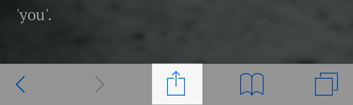
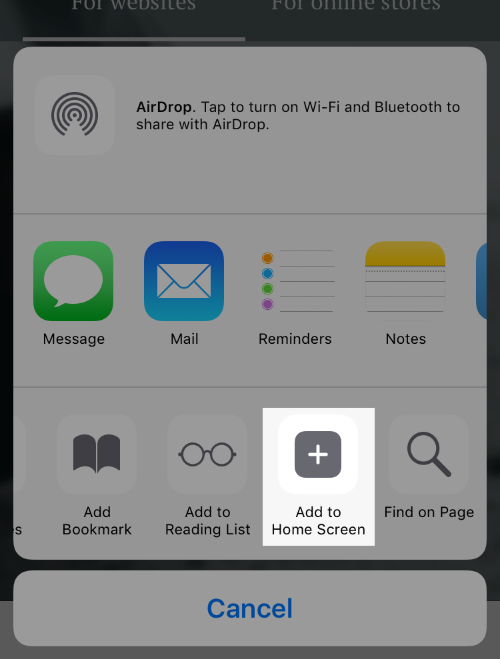
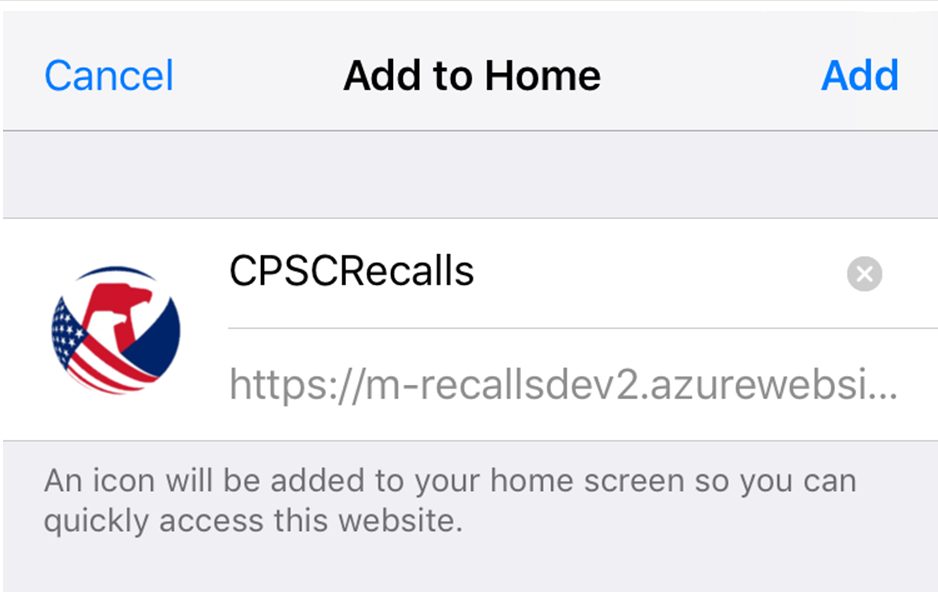

 ## CPSC Recalls Progressive Web App  

  
 

### Background

 The Recalls PWA is a port of CPSC's [recalls internet surveillance widget](https://ecpsc.cpsc.gov/pmo/EXITInitiatives/isw/Documents/Forms/AllItems.aspx?RootFolder=%2Fpmo%2FEXITInitiatives%2Fisw%2FDocuments%2FDeliverables&FolderCTID=0x0120000BB9E5A3ECEE0D4BBC350676DAFBD91E&View=%7B95BF696B%2D9E5F%2D46DD%2DB6C5%2DBE9A697BB570%7D) app originally developed to assist in reducing recalled product exposure through online secondary markets. To accomplish this, the existing [Recalls Application Programming Interface (API)](https://www.cpsc.gov/Recalls/CPSC-Recalls-Application-Program-Interface-API-Information) was leveraged to develop an `HTML` widget that can easily be incorporated by resellers on their websites as an embeddable search tool without requiring a lot of technical expertise from client websites.

 ### Project Goal
 
 The goal of the recalls PWA app is to act as a mechanism that gives consumers convenient access (from their mobile devices) to: 
 -  Latest recalls.
 -  Search for recalls of purchased products. 
 -  Search for recalls to help prevent the purchase of a recalled product. 
 
 The recalls PWA app is easily [installable](#installation) on any mobile or desktop devices and is able to run seamlessly as a mobile application.

### Reusing the Widget's Code To Create the PWA
There is one basic factor that made the recalls widget app PWA ready, cross platform and flexible, it was already written in the only language that all browsers speak, `HTML`, `Javascript` and `CSS`. The mechanism that processes the widget's data and sends it back the results, is a .NET Web API that's entirely replaceable without modifying the widget itself. 

The widget application is simple enough, it has the right architecture, it was using a mobile friendly web framework for layouts.

### What is a PWA
A PWA, progressive web app, encourages the idea of always starting any new development project with a mobile first mindset.
A Progressive web app is:

1. Progressive - Work for every user, regardless of browser choice because they’re built with progressive enhancement as a core tenet.
2. Responsive - Fit any form factor: desktop, mobile, tablet, or forms yet to emerge.
3. Connectivity independent - Service workers allow work offline, or on low quality networks.
4. App-like - Feel like an app to the user with app-style interactions and navigation.
5. Fresh - Always up-to-date thanks to the service worker update process.
6. Safe - Served via HTTPS to prevent snooping and ensure content hasn’t been tampered with. (already done)
7. Discoverable - Are identifiable as “applications” thanks to W3C manifests[6] and service worker registration scope allowing search engines to find them.
8. Re-engageable - Make re-engagement easy through features like push notifications.
9. Installable - Allow users to “keep” apps they find most useful on their home screen without the hassle of an app store.
10. Linkable - Easily shared via a URL and do not require complex installation.


## Search Overview
- The initial search box is key word search and will search in some pre-defined fields in the database. The returned results should be the same as the CPSC’s Recall product web search.

- Advanced search fields include Product Name, Manufacture, Product Type, Product Model, and Date Range. Among all these fields, Date Range is in lower priority.

- System returns initial results when users use key word search. Users can use other advanced search fields to narrow down.

- Manufacture, Product Type and Date Range are drop-down lists. The list of values for Manufacture and Product Type are dynamic. It will change accordingly based on the key word entered by users.

- Users need to fill at least one search field to enable search function.

-----
## Interface
| Search & Filters   | Search Results    | Expanded Recall  | 
| ------------- |:-------------:| -----:|
|      |  |  |    

----

## User Installation

###  Android  

#### Installing from web link

When a user navigates to the application's web url using Chrome, an "add to home screen" banner will automatically pop up to prompt the user for installation similar to the image below


Once the user clicks "Add", the application will be available on their home screen and they will be able to launch it without going to through a browser.

#### Installing from the google play store 


#### Installing from the Windows store 

---------

### IOS    
-------------
#### Installing from web link- Apple App Store doesn't currently support PWAs

When a user navigates to the application's web url using `Safari`, an "add to home screen" banner will *not* automatically pop up to prompt the user for installation. Follow the steps below to install:

#### Step 1

Open safari, navigate to [app url](http://m-recallsdev.cpsc.gov/#/)

#### Step 2

Click on the share icon.



#### Step 3

Click on the "Add to Home Screen" button.



#### Step 4

You can overwrite the default display name that will appear on the home screen or leave it as is then click "Add".



    

Once the user clicks "Add", the application will be available on their homescreen and they will be able to launch it without going to through a browser.


## Architecture
The current architecture includes a `javascript/html/css` application that's interacting with the original Recalls Widget application's `.NET` API/web services. 

> Depending on what the decision is what to do with the recalls widget, it will probably be a good idea to separate the recalls pwa functionality from the widget.

 

### Tooling around the UI

 Tool   | Purpose     | Logo 
| ------------- |:-------------:| -----:| -----:|
| Vue.js     | [Vue.js is an open-source progressive JavaScript framework for building user interfaces](https://vuejs.org/) | 
| Webpack    | [Webpack is an open-source JavaScript module bundler. Its main purpose is to bundle JavaScript files for usage in a browser](https://webpack.js.org/) |  |
| Vuetify    | [a reusable semantic component framework for Vue.js. It aims to provide clean, semantic and reusable components.](https://vuetifyjs.com/en/) |  
| Vue-CLI    | [ For rapid Vue.js development including scaffolding ](https://cli.vuejs.org/) |  |

> The `package.json` file list all the tools and versions.

## Environment
This application can be deployed anywhere because of it's static nature, after the build process, it can be deployed to any web server capable of serving `html` and serve static files.


| Lifecycle   | Server  |  DNS | DNS Status
| ------------- |:-------------:| -----:| ------:|
| Dev         | RMSPREPRODWEB1/WEB2 |  https://m-recallsdev.cpsc.gov | Provisioned |
| Prod        | RMSPRODWEB1/WEB2| https://m-recalls.cpsc.gov | Not Provisioned |

## Deployment
The currently deployed version of the PWA app is hosted in bitbucket: [bitbucket](http://wallstreet:7990/users/alex/repos/recalls-query-pwa/browse?at=refs%2Ftags%2Fv.01)

###  Build Setup

``` bash
# install dependencies
npm install

# serve with hot reload at localhost:8080
npm run dev

# build for production with minification
npm run build

# build for production and view the bundle analyzer report
npm run build --report
```

For detailed explanation on how things work, checkout the [guide](http://vuejs-templates.github.io/webpack/) and [docs for vue-loader](http://vuejs.github.io/vue-loader).

## Roadmap