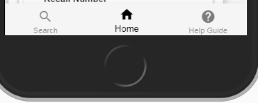
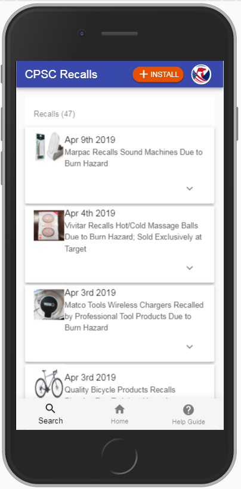

 

# User Guide

## Installation
 
### IOS Devices (Iphone, Ipad etc) 

1.	Navigate to https://m-recalls.cpsc.gov using Safari from your IPhone

2.	Click on “Share” icon present at the bottom of the Safari browser

     

3.	Click on the “Add to Home Screen” button

     

4.	The add to home prompt comes up, click on “Add”

     

5.	Look for CPSC Icon on iPhone home screen

     

### Android Devices 
 

1. Navigate to https://m-recalls.cpsc.gov from your Android device.

2. You should automatically be prompted to install the app.
   
3. Click on “Add” in the installation prompt as in the image below.

     

4. Look for the CPSCRecalls Icon on your device’s home screen then click on it.

     

5. The app opens initially opens with the latest 15 recalls displayed.

## Home Page

The home page displayed the latest 15 recalls. Scroll or swipe right to continue viewing latest recalls.

   

You can click on the dropdown arrow to view the recall description

## Navigation

1.	Navigate back and forth between the search result and the latest recalls (Home/Landing page) with the bottom navigation bar.
        
     

2.	Click on the Home icon (  )to go to the landing page.

3.	Click on the Search icon ( )  to go back to the search results page.

## Search For Recalls

1. To perform a search start by clicking on the search icon.

     

2. Any piece of text can be entered in the “Search For” field, a product type, a manufacturer/retailer/importer name, a product name ,a recall title or description.
(In the example below, a Product Model was entered in the Product Model field)

3. Then click on the “apply” button (  ) and if any records are found, the number of records will be displayed.

4. To view the results, dismiss the search drawer by click anywhere outside of the drawer or by swiping the drawer to the left.

     

5. To clear the search form, click on the reset button ( )

::: tip
The initial fields available for search are
Search For, Product Name, Product Model and the relative date range up to a year from now.
:::

:::  warning NOTE
The Manufacture and the Product Type fields are only available as a dropdown to help narrow down search results
:::

## Search Results

1. To View Details of a recall while scrolling through the search results, expand the recall card by  clicking on the down arrow or by clicking on the view details button

     

    

